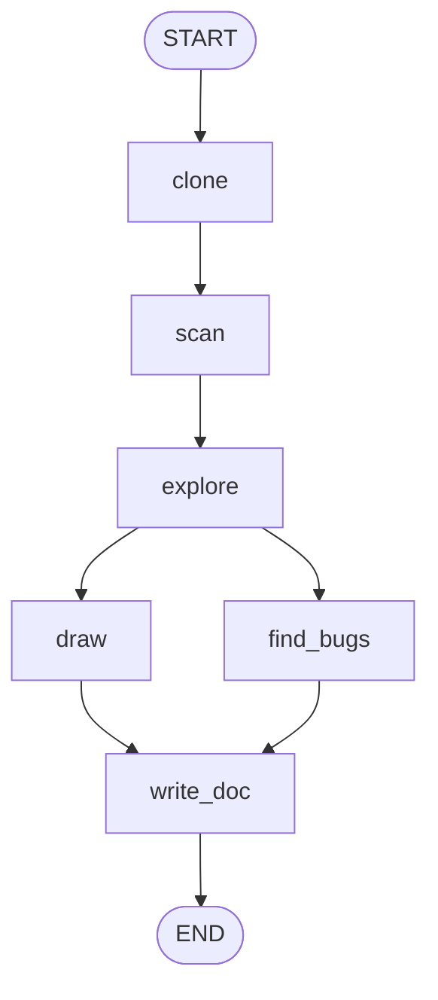

# 🏺 Codebase Archaeologist

An autonomous AI agent that digs through any public GitHub repository and produces:

- an **architecture diagram** (Mermaid)
- a **bug and risk review**
- a **first-day onboarding guide** for new developers
- **repo statistics** (lines of code, contributors, bus factor, most-changed files)
- a **chat** where you can ask questions about the code
- a **flow tracer** that draws a sequence diagram for any flow you describe

Built with **LangGraph**, **Streamlit**, **Mermaid.js** and **NVIDIA Nemotron 3 Ultra** (any OpenAI-compatible model also works).

---

## Contents

1. [How it works](#how-it-works)
2. [Project structure](#project-structure)
3. [Setup](#setup)
4. [Running it](#running-it)
5. [Using the app](#using-the-app)
6. [Configuration](#configuration)
7. [How the architecture diagram is built](#how-the-architecture-diagram-is-built)
8. [Troubleshooting](#troubleshooting)
9. [Limitations](#limitations)
10. [Security and privacy](#security-and-privacy)
11. [Demo guide](#demo-guide)
12. [Ideas for extending it](#ideas-for-extending-it)

---

## How it works

The analysis is a **LangGraph** pipeline. All nodes share one state dictionary, and each node returns only the keys it changes.



| Node | Uses LLM? | What it does |
| --- | --- | --- |
| `clone` | No | Validates the URL, then runs a shallow `git clone --depth 300` into a temp folder |
| `scan` | No | Builds the file tree (2 levels deep), counts languages, finds most-changed files from git history, computes repo statistics |
| `explore` | Yes | The autonomous part: the LLM decides which file to open next (up to 8 files) and says when it understands enough |
| `draw` | Yes | The LLM returns architecture as JSON; Python converts it to valid Mermaid. If that fails, a folder-based diagram is drawn instead |
| `find_bugs` | Yes | Regex scan for risky patterns, then the LLM ranks the findings using only that evidence |
| `write_doc` | Yes | Writes the 9-section onboarding guide and inserts the diagram |

`draw` and `find_bugs` run **in parallel** (fan-out), and `write_doc` waits for both (fan-in). They write different state keys (`mermaid` and `bugs`), so they never conflict.

**Design principle:** deterministic code collects facts (structure, statistics, git history, regex hits), and the LLM does the judgment. This keeps hallucination low.

---

## Project structure

```
codebase-archaeologist/
├── agent.py           # LangGraph pipeline, LLM clients, analysis logic
├── features.py        # disk cache, chat with the repo, flow tracer
├── app.py             # Streamlit user interface
├── requirements.txt   # Python dependencies
├── README.md          # this file
├── .env               # YOUR API key (you create this; never commit it)
└── .cache/            # saved results per commit (created automatically)
```

---

## Setup

### Requirements

- Python 3.10 or newer
- `git` installed and on your PATH (check with `git --version`)
- An NVIDIA API key (free at <https://build.nvidia.com>)

### Steps

```bash
# 1. Go into the project folder
cd codebase-archaeologist

# 2. (Recommended) create a virtual environment
python -m venv .venv
source .venv/bin/activate          # Windows: .venv\Scripts\activate

# 3. Install dependencies
pip install -r requirements.txt
```

### Add your API key

Create a **file** named exactly `.env` next to `agent.py` (not a folder, and not `.env.txt`), containing one line:

```
NVIDIA_API_KEY=nvapi-xxxxxxxxxxxxxxxx
```

Do not add `export`, quotes, or spaces around the `=`. NVIDIA keys start with `nvapi-`.

Optional settings can go in the same file. See [Configuration](#configuration).

---

## Running it

**Web app (recommended):**

```bash
streamlit run app.py
```

Open the URL Streamlit prints (usually <http://localhost:8501>).

**Command line (good backup for demos):**

```bash
python agent.py https://github.com/owner/repo
```

This writes `ONBOARDING.md` in the current folder.

> **Important:** after editing any `.py` file, stop Streamlit with `Ctrl+C` and start it again. Streamlit does not reload imported files such as `agent.py` and `features.py` on its own.

---

## Using the app

1. Paste a **public** GitHub URL in the form `https://github.com/owner/repo`.
2. Click **Dig in**. A live checklist shows each node as it finishes, and lists the files the agent chose to read.
3. Explore the five tabs:

| Tab | What you get |
| --- | --- |
| 📘 **Onboarding** | The first-day guide: what the project does, tech stack, architecture walkthrough, directory map, how to run it, key flows, first tasks, risks, and git hotspots. Download it as `ONBOARDING.md` |
| 🗺️ **Architecture** | The Mermaid diagram, a source box, and a `.mmd` download. Below it, the **flow tracer**: describe a flow (e.g. "what happens when a user logs in?") and get a sequence diagram |
| 🐞 **Likely bugs** | Ranked findings with severity, file and line, why it matters, and a suggested fix. Download as markdown |
| ⛏️ **Archaeology** | Lines of code by language, commit count, contributors, **bus factor** (fewest people behind 50% of recent commits), churn hotspot chart, top contributors. No LLM needed |
| 💬 **Ask the repo** | A chat. For each question the agent picks up to 4 relevant files, reads them, and answers with file paths |

**Cache:** results are saved by commit SHA. Re-running an unchanged repo loads instantly. When the repo gets a new commit, it is re-analysed.

---

## Configuration

Set these in `.env` (or as environment variables):

| Variable | Default | Purpose |
| --- | --- | --- |
| `NVIDIA_API_KEY` | none (required) | Your NVIDIA API key |
| `ARCH_MODEL` | `nvidia/nemotron-3-ultra-550b-a55b` | Model name |
| `ARCH_BASE_URL` | `https://integrate.api.nvidia.com/v1` | OpenAI-compatible endpoint |
| `ARCH_THINKING` | `1` | Set `0` to turn off reasoning for the diagram, review and guide. Much faster, usually still good |

**LLM clients** (defined in `agent.py` and `features.py`):

- `fast`: thinking off, 1,024 tokens. Explorer loop and file picking
- `plain`: thinking off, 4,096 tokens. Architecture JSON
- `mid`: thinking off, 4,096 tokens. Chat and flow tracer
- `llm`: thinking on (unless `ARCH_THINKING=0`), 16,384 tokens. Bug review and guide

**Using another provider:** set `ARCH_BASE_URL`, `ARCH_MODEL` and the matching key. For OpenAI the key variable is `OPENAI_API_KEY`. Note that `make_llm` sends an NVIDIA-specific setting (`chat_template_kwargs`) that other providers may reject. If you see a 400 error, remove that `extra_body` line. Switching providers is untested.

**Tunable constants in `agent.py`:** `MAX_STEPS` (files the explorer may read, default 8), `IGNORE` (folders skipped), `SRC` (source extensions), `PATTERNS` (regex bug checks).

---

## How the architecture diagram is built

The diagram is **inferred by the LLM from evidence**, not computed from the code's real call graph.

1. **Collect the skeleton.** `scan` builds the file tree, language counts and git hotspots.
2. **Read key files.** `explore` lets the LLM open up to 8 files (README, manifests, entrypoints, core modules). These show how the app starts, which databases and services it uses, and how it is layered.
3. **Ask for JSON, not Mermaid.** `draw` sends everything to the LLM and asks for `{"nodes": [...], "edges": [...]}`, 6 to 14 nodes.
4. **Python writes the syntax.** `build_mermaid` gives each node a safe id (`n0`, `n1`, ...), cleans labels, quotes them, and skips self-loops and duplicate edges (they crash Mermaid 10). Invalid Mermaid from model punctuation is therefore avoided.
5. **Fallback.** If the JSON is invalid after two tries, `fallback_mermaid` draws the repository and its top-level folders.
6. **Render.** The browser loads mermaid.js from a CDN, waits until the frame is visible, validates with `mermaid.parse`, and draws. On failure it retries with straight edges, then without edge labels, and only then shows the error text.

The **flow tracer** uses the same approach: the LLM returns participants and messages as JSON and Python writes the `sequenceDiagram`.

Diagram quality depends on which files the explorer read. Check the "📂 Read:" line in the status list. If it is empty, you get a generic diagram.

---

## Troubleshooting

| Problem | Cause and fix |
| --- | --- |
| `401 Unauthorized` | Key missing or wrong. Check that `.env` is a file next to `agent.py`, the variable is `NVIDIA_API_KEY`, there are no quotes or spaces, and you restarted Streamlit. Test the key: `curl -s https://integrate.api.nvidia.com/v1/models -H "Authorization: Bearer $NVIDIA_API_KEY" \| head -c 300` |
| `400 ... thinking_token_budget ... V2 model runner` | Old code sent an unsupported `reasoning_budget` setting. Use the current `agent.py` |
| `NVIDIA_API_KEY is not set` | The app cannot see your key. See the 401 row |
| Mermaid "Syntax error in text" | You are running old code or an old cache. Stop Streamlit, delete `.cache/`, restart |
| "Could not find a suitable point for the given distance" | Mermaid layout bug from self-loops, duplicate edges, or drawing in a hidden tab. Fixed in the current code. Restart Streamlit |
| Red "Diagram error" line still shows | Open "Diagram source" on the Architecture tab, paste it into <https://mermaid.live> to see the cause |
| Diagram is only folder boxes | The LLM step failed quietly and the fallback was used. Check the "📂 Read:" line and your API key or rate limits |
| Blank diagram frame | mermaid.js is loaded from `cdn.jsdelivr.net`. A firewall, VPN or ad-blocker may block it |
| Guide or review is empty or cut off | Reasoning used up the output tokens. Set `ARCH_THINKING=0` |
| Very slow runs | Set `ARCH_THINKING=0`, or try a smaller repo |
| `git` not found | Install git and make sure it is on your PATH |
| Changes have no effect | Stop Streamlit with `Ctrl+C` and start it again |
| Rate-limit errors | The free tier is rate-limited. Requests retry up to 4 times. Wait a minute, or use cached results |
| Old results shown | Delete the `.cache/` folder |

---

## Limitations

- **Public GitHub repos only** (`https://github.com/owner/repo`).
- **Git history covers the last 300 commits** (shallow clone). Contributor stats and bus factor reflect only that window.
- **Shallow reading.** The explorer reads at most 8 files (first 6,000 characters each). Huge monorepos get a partial picture.
- **Inferred architecture.** The diagram shows the LLM's understanding, not a parsed call graph.
- **Bug review can include false positives.** It is based on regex hits plus LLM judgment, and is not a replacement for a real security scanner.
- **Source languages scanned:** Python, JavaScript, TypeScript, Go, Rust, Java, Ruby, PHP, C, C++, C#, Kotlin.

---

## Security and privacy

- The URL is validated with a strict regex, so only `https://github.com/...` repos are cloned.
- Repositories are **only read as text and never executed**. File reads are sandboxed to the cloned folder (no `../` escapes) and binary files are skipped.
- **Prompt injection:** a malicious repo could hide instructions in its files that try to steer the model. The impact is limited, because the output is only text shown to you.
- **Privacy:** file contents are sent to the model provider. NVIDIA's free hosted endpoint may log prompts, so use **public repos only**.
- Never commit your `.env` file. Add it to `.gitignore`.

---

## Demo guide

**Before presenting**

- Run 2 or 3 repos your audience knows (for example Flask or Express) so results are cached and load instantly.
- Set `ARCH_THINKING=0` if you want faster live runs.
- Keep `python agent.py <url>` ready as a backup if the UI or Wi-Fi fails.

**Suggested flow (about 3 minutes)**

1. Paste a well-known repo and click **Dig in**. Point out the live checklist and the files the agent chose to read on its own.
2. Show the **Architecture** tab, then use the flow tracer on something the audience knows ("how does a request get routed?").
3. Show **Archaeology**: bus factor and churn hotspots make good talking points.
4. Open **Ask the repo** and let someone in the audience ask a question about code they know.
5. Show the LangGraph flow: parallel `draw` and `find_bugs`, then `write_doc`.

**Talking points**

- Autonomous: the agent decides what to read and when to stop.
- Hybrid: code gathers facts and the LLM does judgment, so it hallucinates less.
- Reliable diagrams: Python writes the Mermaid syntax, with a guaranteed fallback.
- Cached: unchanged repos load instantly.

---

## Ideas for extending it

- Model the explorer loop as a LangGraph cycle with conditional edges
- Parse real imports (`ast` for Python) to add true dependency edges to the diagram
- Auto-repair diagrams by feeding the Mermaid error back to the LLM
- Dependency risk check (outdated or vulnerable packages from manifests)
- Test-gap finder (modules without matching tests)
- PR-style review of a pasted diff, grounded in the repo's conventions
- Private repo support through the GitHub API with a token
- Compare two repos side by side
